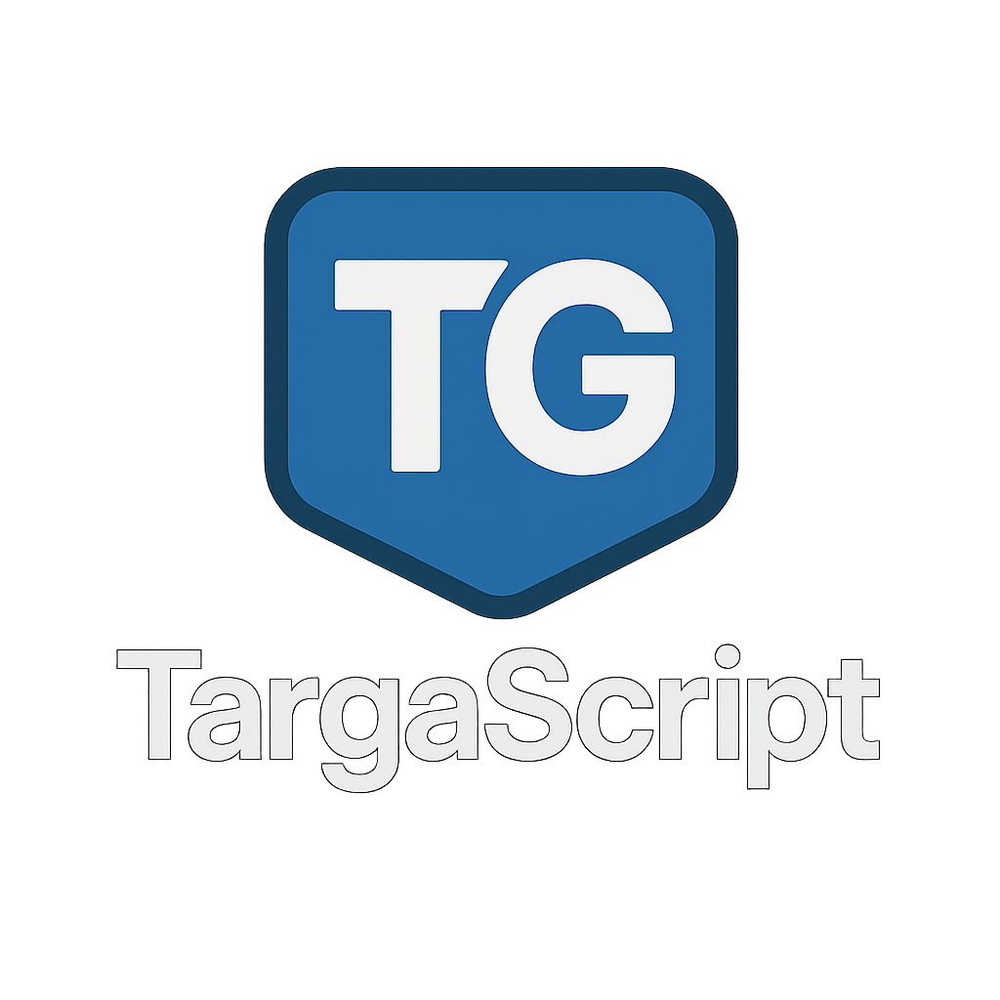

# TargaScript 🚀

> If TypeScript can be rewritten in Go, why not create our own language with Go?

TargaScript is a modern, expressive programming language implemented entirely in Go.

## 🌟 Features

- Clean, intuitive syntax
- First-class functions
- Object literals
- Module loading with imports
- Loop constructs like `repeat...in`
- Conditionals with `if/else`

## 📝 Code Examples

Hello World:
```ts
print("Hello, World!")
```

Variables and Functions:
```ts
let name = "Targa"
const version = 1.0
let isCool = true

fn greet(person) {
  print("Hello, " + person)
}

greet(name)  // Prints: Hello, Targa
```

Conditional Logic:
```ts
if name == "Targa" {
  greet(name)
} else {
  print("Who are you?")
}
```

Objects:
```ts
let app = {
  name: name,
  version: version,
  greeting: greet(name)
}
```

Loops:
```ts
repeat i in 1..3 {
  print("number: " + i)
}
```

Importing Modules:
```ts
load math
load fs as file
```

## 🚧 Project Status

TargaScript is currently in early development. The lexer is functional and the parser is being developed.

## 🔨 Building & Running

*Instructions coming soon!*

## 🤔 Why TargaScript?

Because creating a programming language is one of the most fun and educational projects a developer can undertake! TargaScript is an experiment in language design, compiler construction, and a way to better understand how programming languages work under the hood.

## 📚 License

TBD

---

*This README is a work in progress and will be expanded as the language develops.*